# 🌾 Kaggriculture: Championship AI Agents & Dynamic Market Simulation

[](https://www.kaggle.com/competitions/kaggriculture)
[](https://www.python.org/)
[](LICENSE)
[](https://pypi.org/project/kaggle-environments/)
[](#-rigorous-benchmark--league-evaluation)

> **Official Competition Link:** [kaggle.com/competitions/kaggriculture](https://www.kaggle.com/competitions/kaggriculture)  
> High-performance autonomous AI agents, non-linear market pricing engines, and game simulation harnesses built for the **Kaggle Kaggriculture $50,000 AI Simulation Challenge**.

---

## 📖 Table of Contents
1. [Overview & Game Theory](#-overview--game-theory)
2. [Agent Architecture & Models](#-agent-architecture--models)
   - [Bot A: Master Tactical Planner (Primary Champion)](#1-master-tactical-planner-primary-champion--mainpy)
   - [Bot B: Adversarial Market Predator](#2-adversarial-market-predator--adversarial_ambushpy)
   - [Bot C: Economics-First Strategic Planner (V2)](#3-economics-first-strategic-planner--v2_planner_backuppy)
3. [The Mathematical Mechanics](#-the-mathematical-mechanics)
   - [Non-Linear Price Formulation](#exact-non-linear-price-formulation)
   - [Net Present Value (NPV) Investment Model](#net-present-value-npv-investment-model)
   - [Town Demand & Inventory Drainage Cycles](#town-demand--inventory-drainage-cycles)
4. [Rigorous Benchmark & League Evaluation](#-rigorous-benchmark--league-evaluation)
5. [Repository Structure](#-repository-structure)
6. [Quickstart & Reproduction](#-quickstart--reproduction)
   - [Installation](#1-installation)
   - [Run Head-to-Head Matches](#2-run-head-to-head-matches)
   - [Execute Paired League Evaluation](#3-execute-paired-league-evaluation)
   - [Build & Submit Agent to Kaggle](#4-build--submit-agent-to-kaggle)
7. [License & Attributions](#-license--attributions)

---

## 🎯 Overview & Game Theory

**Kaggriculture** is a 2-player turn-based economic game simulating real-world supply chains, multi-unit labor scheduling, and dynamic price equilibration over a 30-day season (720 turns, 24 turns/day).

### Key Mechanics
- **Asymmetric Spatial Grid:** $10 \times 10$ board segmented into four $5 \times 5$ quadrants (`NW`, `NE`, `SW`, `SE`). Players start with only `NW` unlocked and expand for $\$1{,}000$, $\$2{,}000$, and $\$4{,}000$.
- **Dynamic Labor Costs:** Farmers can hire $N$ additional farm hands per day. Costs scale with the Fibonacci sequence ($\$1, \$1, \$2, \$3, \$5, \$8, \$13, \dots$), resetting daily at midnight.
- **Dynamic Reactive Order Books:** Goods are traded against an automated market maker initialized with $I_0 = 10{,}000$ units. Bulk sales induce slippage and price depreciation according to non-linear per-commodity curves (`hinge`, `sq`, `sqrt`, `log`, `linear`).
- **Autonomous Town Sink:** Town Center and up to 8 randomized town shops consume inventory on fixed cadences (every 4 or 24 turns), creating artificial liquidity and price recovery windows.
- **Strict Survival Constraints:** Plants wither into weeds if left unwatered for 2 consecutive days. Animals escape if left unfed (requiring 1 wheat/day).

```
+-------------------------------------------------------------------------------+
|                             KAGGRICULTURE GAME LOOP                           |
|                                                                               |
|  [Hour 0..23]                                                                 |
|   ├── Unit Choreography (Move, Plant, Water, Harvest, Care, Feed)             |
|   ├── Order Book Processing (BUY_SEED, BUY_PRODUCT, BUY_ANIMAL, SELL, HIRE)   |
|   └── Town Drain Execution (Town Center & Randomized Shops consume inventory) |
|  [Midnight Refresh]                                                           |
|   ├── Animal Fertilizer Drop & Survival Verification                          |
|   ├── Unwatered / Unfed Decay Checks                                          |
|   └── Labor Cost Fibonacci Reset                                              |
+-------------------------------------------------------------------------------+
```

---

## 🤖 Agent Architecture & Models

This repository contains three battle-tested autonomous agents, engineered for specific competitive environments.

### 1. Master Tactical Planner (Primary Champion — `main.py`)
Our primary Kaggle submission combining frame-perfect action execution with dynamic economic arbitrage:
- **Core Chassis (The 2945 Farm Lineage):** Frame-perfect choreographed movement and action tapes for early worker mobilization, land clearance, structure placement, and shop delivery routes.
- **Gluzdov Market Shock Productive Opening:** Eliminates Day 0 worker idling: Farm Hand 1 moves to coordinate `(2,4)` to plant and water an extra wheat crop on the future pasture tile. Harvested on Day 2 (turn 54) and delivered at turn 57, generating critical early liquidity before market prices decline. Pasture is restored without losing a single livestock turn.
- **`nomilk` Transition Logic:** Dynamically preserves high-value Cow livestock whenever milk-consuming shops (`PIZZA_SHOP`, `ICE_CREAM_SHOP`, `SMOOTHIE_SHOP`) are active on the board, maximizing milk sales at $\sim\$160$/unit.
- **Strict Wheat Feed Protection:** Partitions shed inventory such that $N_{\text{animals}} \times (30 - \text{Day})$ units of wheat are locked away from the market sell queue, guaranteeing 0% animal abandonment.
- **Terminal Asset Liquidation:** Triggers total warehouse liquidation over turns 710–718, liquidating stored wheat, fertilizer, and high-value produce into cash before the season concludes.

### 2. Adversarial Market Predator (`bot_adversarial/` & `adversarial_ambush.py`)
Designed specifically to counter high-volume industrial farming bots on the Kaggle ladder:
- **Rival Shadow Tape & War Chest:** Tracks opponent inventory accumulation. Accumulates a dedicated war chest starting on Day 26 (step 624), preserving 100% of early/mid-game capital for farm expansion.
- **Dynamic Weapon Evaluator:** Continuously computes the price depression derivative across high-volatility commodities (`MELON`, `WOOL`, `STRAWBERRY`, `MILK`). Identifies the exact asset where an opponent liquidation dump is imminent.
- **Slot 0 Ambush & Front-Running:** At steps 710 and 713, injects pre-emptive sell orders into Order Slot 0. Craters market depth down to the $\$1.00$ price floor *before* the opponent's bulk order (placed in slots 3–7) executes its first unit.
- **Asymmetric Safety Gate:** Automatically falls back to optimal liquidation if the simulated damage to the opponent does not substantially exceed our own sacrifice.

### 3. Economics-First Strategic Planner (`v2_planner_backup.py` & `V2_DESIGN.md`)
A ground-up analytical planner replacing rule heuristics with continuous mathematical optimization:
- **Continuous NPV Gating:** Replaces hardcoded phase shifts with Net Present Value gating.
- **Discrete Depth Integration:** Calculates marginal revenue $\Delta R = \sum_{k=1}^N P(I_k)$ across the order book to avoid price crashing from bulk dumps.
- **Stateful Task-Chain Decomposition:** Guarantees units execute `PICKUP` before `FEED`, `FERTILIZE`, or `PLACE`, preventing silent failure bugs.

```mermaid
graph TD
    Obs[Kaggle Observation] --> GS[GameState Parser]
    GS --> MM[Exact Market Pricing Engine]
    GS --> OM[Opponent Inventory Tracker]
    MM & OM & GS --> EE[Net Present Value Evaluator]
    EE --> SS[Strategic Cycle Planner]
    SS & GS --> TP[Task Priority Queue]
    TP & GS --> WS[Greedy Worker Scheduler]
    WS --> AE[Action Emitter: Farmer + Hands]
    EE & GS & MM --> MOG[Market Order Generator: Sell-First]
    MOG --> AE
```



---

## 📐 The Mathematical Mechanics

### Exact Non-Linear Price Formulation

Market prices deviate from base price $P_{\text{base}}$ according to inventory divergence from equilibrium $I_0 = 10{,}000$:

$$P(\text{inv}) = \max\left(1, \left\lfloor P_{\text{base}} + \text{sign} \cdot \text{amp} \cdot f(|\text{inv} - I_0|) + 0.5 \right\rfloor\right)$$

where:
- $\text{sign} = +1$ if $\text{inv} < I_0$ (scarcity) and $-1$ if $\text{inv} > I_0$ (glut)
- $\text{amp} = \frac{\text{target} \cdot P_{\text{base}}}{f(T)}$
- $T$ is the 24-day baseline capacity of a $5 \times 5$ field

#### Per-Commodity Parameter Matrix

| Commodity | Base ($P_0$) | Capacity ($T$) | Scarcity Curve ($< I_0$) | Target$_{\text{below}}$ | Glut Curve ($> I_0$) | Target$_{\text{above}}$ | $P(I_0 - T)$ | $P(I_0 + T)$ | $P(I_0 + 2T)$ |
|:---|:---:|:---:|:---:|:---:|:---:|:---:|:---:|:---:|:---:|
| **Wheat** | \$25 | 400 | `sqrt` | 0.80 | `log` | 0.20 | \$45 | \$20 | \$19 |
| **Carrot** | \$35 | 450 | `hinge` | 1.00 | `sqrt` | 0.70 | \$70 | \$10 | \$1 |
| **Tomato** | \$60 | 200 | `hinge` | 0.40 | `sqrt` | 0.60 | \$84 | \$24 | \$9 |
| **Strawberry** | \$120 | 100 | `sqrt` | 0.70 | `linear` | 1.60 | \$204 | \$1 | \$1 |
| **Melon** | \$250 | 300 | `log` | 0.20 | `sq` | 3.60 | \$300 | \$1 | \$1 |
| **Egg** | \$50 | 332 | `hinge` | 0.40 | `log` | 0.20 | \$70 | \$40 | \$39 |
| **Milk** | \$160 | 122 | `sqrt` | 0.60 | `linear` | 1.60 | \$256 | \$1 | \$1 |
| **Wool** | \$200 | 105 | `log` | 0.20 | `sq` | 2.20 | \$240 | \$1 | \$1 |
| **Fertilizer** | \$100 | 200 | `linear` | 0.40 | `linear` | 0.40 | \$140 | \$60 | \$20 |

> **Hinge Shape Function:** $f(x, T) = u + 8 \cdot \max(0, u - 1)^2$ where $u = x / T$. Produces linear price scaling under standard demand and quadratic price spikes once demand surpasses capacity $T$.

---

### Net Present Value (NPV) Investment Model

Before planting crops or purchasing livestock, the agent evaluates the expected discounted cash flow:

$$\text{NPV}_{\text{crop}}(t) = \mathbb{E}\left[\text{Yield} \times P(\text{Harvest Day})\right] - C_{\text{seed}} - \sum_{\tau=t}^{t_{\text{harvest}}} C_{\text{labor}}(\tau)$$

$$\text{NPV}_{\text{animal}}(t) = \sum_{\tau=t}^{T_{\text{season}}} \mathbb{E}\left[\text{Yield}(\tau) \times P(\tau) + P_{\text{fert}}\right] - \sum_{\tau=t}^{T_{\text{season}}} P_{\text{wheat}}(\tau) - C_{\text{animal}} - C_{\text{structure}}$$

Investments automatically terminate when marginal NPV drops below zero (e.g., melon planting ceases at Day 20, new livestock ceases at Day 22).

---

### Town Demand & Inventory Drainage Cycles

- **Town Center:** Consumes 1 unit of every non-fertilizer commodity every 24 turns (flat rate).
- **Town Shops (up to 8 unlocked):** Consume demanded goods every 4 turns:
  - *Bakery:* Eggs, Wheat
  - *Pizza Shop:* Milk, Tomatoes, Wheat
  - *Brunch Spot:* Eggs, Wheat, Strawberries
  - *Yarn Store:* Wool (2x)
  - *Ice Cream Shop:* Strawberries, Milk, Wheat
  - *Pet Cafe:* Carrots (2x)
  - *Smoothie Shop:* Strawberries, Milk
  - *Farmers Market:* Wheat, Carrots, Tomatoes, Strawberries

---

## 🏆 Rigorous Benchmark & League Evaluation

All evaluations are conducted under **strict paired testing** across identical `(seed, opponent, seat)` triples for both Seat 0 and Seat 1 to completely eliminate board layout variance and seat advantage.

### 1. Opponent League Performance (10-Game Paired Matches per Opponent)

| Opponent Benchmark | Match Format | Record (W-L-T) | Win Rate | Paired Delta Margin (95% CI) | Status |
|:---|:---:|:---:|:---:|:---:|:---:|
| **Upstream 2945 Farm** | 10 Paired Games | **7W - 3L - 0T** | **70.0%** | **+\$1,240** [+\$420, +\$2,060] | Champion Ahead |
| **Market Shock Baseline** | 10 Paired Games | **6W - 4L - 0T** | **60.0%** | **+\$680** [-\$110, +\$1,470] | Positive Margin |
| **Deterministic Starter** | 20 Paired Games | **20W - 0L - 0T** | **100.0%** | **+\$3,850** [+\$3,100, +\$4,600] | Undefeated |

### 2. Generalization Across Out-Of-Distribution (OOD) Seeds
Tested across seeds `[42, 12345, 99999, 777777, 20260920]`:
- **Average Cash Balance:** **\$5,120+**
- **Crash Rate:** **0.0%** (zero timeouts, zero status faults, zero animal escapes)
- **Turn Latency:** **0.32 ms - 0.52 ms / turn** (budget is 25 ms, operating at ~50x speed)

---

## 📁 Repository Structure

```
.
├── main.py                             # 🌟 PRIMARY CHAMPION AGENT (Single-file Kaggle entrypoint)
├── submission.py                       # Exact production submission source
├── adversarial_ambush.py               # ⚔️ Adversarial Predator & Market Ambush layer
├── v2_planner_backup.py                # 📐 Pure Economics-First Strategic Planner (NPV)
├── V2_DESIGN.md                        # Full mathematical design document for V2
│
├── bot_adversarial/                    # Standalone Adversarial Bot package
│   ├── main.py                         # Wrapper importing core engine
│   └── core_engine.py                  # Core tactical chassis
│
├── league_eval_harness.py              # 🧪 Peer-reviewed paired league tournament runner
├── eval_head_to_head.py                # Head-to-head match harness
├── run_extensive_eval.py               # 24-game multi-seed tournament evaluation
├── run_ablation_matrix.py              # Causal ablation runner testing speculative layers
│
├── FINAL_NOTEBOOK.ipynb                # 📓 Official end-to-end tournament & submission notebook
├── kaggriculture_champion_notebook.ipynb # Championship standalone notebook
│
├── build_adversarial_submission.py     # Builder script for adversarial tarball
├── create_final_notebook.py            # Builder script for reproducible notebook
├── opponent_2945_upstream.py           # Benchmark Opponent: Upstream 2945 Farm
├── opponent_market_shock.py            # Benchmark Opponent: Market Shock baseline
│
├── submission.tar.gz                   # Pre-built submission package (Champion)
├── submission_adversarial.tar.gz       # Pre-built submission package (Adversarial)
├── NOTICE.txt                          # Attribution & open-source lineage notices
├── LICENSE                             # Apache License 2.0
└── README.md                           # Documentation & specs
```

---

## 🚀 Quickstart & Reproduction

### 1. Installation

Requires Python 3.10+ and the official `kaggle-environments` simulation engine:

```bash
# Clone the repository
git clone https://github.com/ayushshuklaivyleague-jpg/kaggriculture-ai-simulation.git
cd kaggriculture-ai-simulation

# Install dependencies
pip install -U kaggle-environments numpy
```

---

### 2. Run Head-to-Head Matches

Test the Champion agent (`main.py`) against any opponent or baseline locally:

```bash
# Test Champion vs Built-in Starter
python -c "
from kaggle_environments import make
import main

env = make('kaggriculture', configuration={'episodeSteps': 720, 'seed': 42}, debug=True)
env.run([main.agent, 'starter'])
final = env.steps[-1]
print(f'Champion Reward: ${final[0].reward:,.0f} | Starter Reward: ${final[1].reward:,.0f}')
"
```

Or execute the complete 10-match head-to-head suite:
```bash
python eval_head_to_head.py
```

---

### 3. Execute Paired League Evaluation

Run the peer-reviewed tournament evaluating against realistic trading bots with bootstrapped 95% confidence intervals:

```bash
python league_eval_harness.py
```

Run the 24-game multi-seed stress test:
```bash
python run_extensive_eval.py
```

---

### 4. Build & Submit Agent to Kaggle

#### Option A: Submit Single-File Champion
```bash
kaggle competitions submit kaggriculture -f main.py -m "Kaggriculture Champion Tactical Planner v9.3"
```

#### Option B: Submit Adversarial Bot Archive
```bash
python build_adversarial_submission.py
kaggle competitions submit kaggriculture -f submission_adversarial.tar.gz -m "Adversarial Market Predator"
```

#### Option C: Monitor Submission & Episodes
```bash
# View active submission status
kaggle competitions submissions kaggriculture

# Download recent episode replays
kaggle competitions episodes <SUBMISSION_ID>
kaggle competitions replay <EPISODE_ID> -p ./replays
```

---

## 📜 License & Attributions

This project is licensed under the **Apache License 2.0**. See [LICENSE](LICENSE) for details.

### Upstream Attributions & Lineage
- **The 2945 Farm Chassis:** Built on foundational work by Thomas Tschinkel, yhay81, destbreso, aurax7, tetsutani, and prvsiyan under Apache-2.0.
- **Productive Opening:** Dmitrii Gluzdov (temporary early wheat planting on future pasture tile).
- **Economic Formulation & Ambush Systems:** Ayush A. Shukla (Exact pricing engine, continuous NPV evaluator, Rival Shadow Tape, Slot 0 Terminal Ambush).

Full attribution notices are retained in [NOTICE.txt](NOTICE.txt) and at the top of [main.py](main.py).
